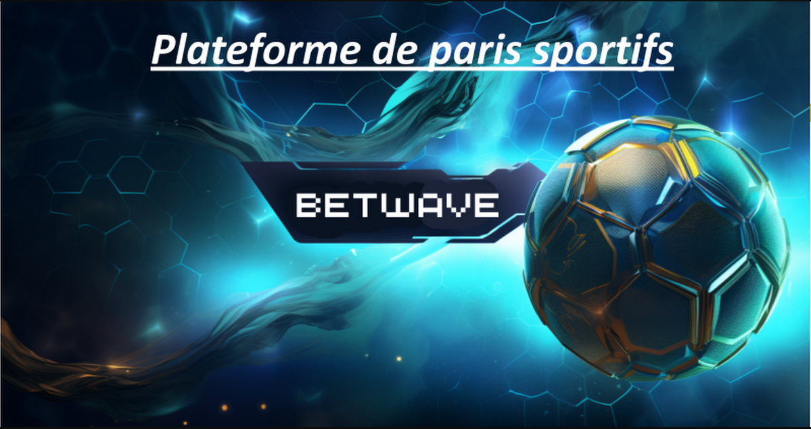

# BetWave


## Déploiement
Lien Déploiement: [betWave](https://alyra-final-project-five.vercel.app/)  

Déployé sur sépolia : [Sepolia etherscan_betWaveDAO](https://sepolia.etherscan.io/address/0x99491F453441978f02f6e841a1EF5336Ba4f9935#code)

Déployé sur sepolia : [Sepolia_etherscan_betWaveOrganizer](https://sepolia.etherscan.io/address/0xaf4c47C65cA567A3f7F1FA54Be72134F8C9e534c#code)

## DAO
Les règles de la DAO sont inscrite sur la page DAO, Vous pouvez demander un vote pour les changer si vous etes validateurs. 
Attention toutefois à ne pas mettre un chiffre trop élevé de validateurs (fees plus sécurité).

* Valeurs modifiable:
  * ***Nombre de validateurs*** : Nombre de personne requise pour créer un nouveau pari et pour valider un pari.
  * ***Récompense créateur*** : Pourcentage du montant total du pari rendu au créateur.
  * ***Récompense plateforme*** : Pourcentage du montant total du pari rendu à la plateforme.
  * ***Récompense validateur*** : Pourcentage du montant total du pari rendu aux validateurs (seul les x premiers validateurs sont concerné,
  x designant le nombre de validateur vu au dessus.
  * ***quorum dao*** : Pourcentage de vote requis pour valider un vote sur la dao (Ce vote n'est pas rémunérer).
  * ***quorum pari*** : Pourcentage de vote requis pour valider un pari.

## Backend

 * Démarrer blockchain locale : ```npx hardhat node```
 * Démarrer les tests : ```npx hardhat test```
 * Démarrer les tests avec coverage: ```npx hardhat coverage```
 * Déployer : ```npx hardhat run "script" --network "network option"```
 * Verifier les contrats : ```npx hardhat verify --network "network option" "contract address" "argument"```

## Frontend

 * Démarrer le serveur: ```npm run build```